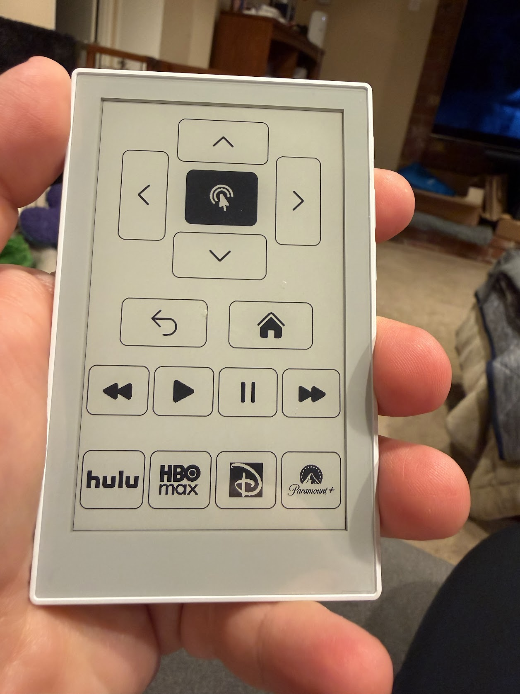

# Basement Remote

Touchscreen TV remote firmware for the **Seeed Studio reTerminal Sticky**, backed directly by Home Assistant over ESPHome's encrypted native API.

Current firmware on `main`: **v0.2.14**. The authoritative version is the `firmware_version` substitution in [`esphome/basement-remote-sticky.yaml`](esphome/basement-remote-sticky.yaml).

<p align="center">
  
</p>

## Architecture

The Sticky is another front end for the already-working Home Assistant **Basement Remote** setup. It uses the same Apple TV and TV entities directly rather than introducing a second remote-control architecture.

```text
Sticky touchscreen / physical buttons
        ↓
ESPHome encrypted native API
        ↓
Home Assistant actions
        ↓
Apple TV / HDMI-CEC / LG TV
```

The firmware does not use `automation.remote_navigation_2` or `esphome.remote_button_pressed` as its control plane.

## Home Assistant dependencies

The current firmware directly depends on these Home Assistant entities:

- `remote.basement_apple_tv` — navigation, transport, power, and volume commands
- `media_player.basement_apple_tv` — streaming-service app launchers via `media_player.select_source`
- `media_player.basement_tv` — authoritative TV power state for the remote's deep-sleep lifecycle

`media_player.basement_sonos_arc` is **not currently controlled by the Sticky firmware**. Earlier firmware exposed a Sonos mute control, but the current UI uses that space for app launchers instead.

For the ESPHome integration, Home Assistant must have **Allow the device to perform Home Assistant actions** enabled.

## Current controls

| Control | Behavior |
| --- | --- |
| Physical AI / Power button, short press | Apple TV `wakeup` |
| Physical AI / Power button, hold ≥ 800 ms | Apple TV `suspend` |
| Physical upper side button | Apple TV `volume_up` |
| Physical lower side button | Apple TV `volume_down` |
| Touch D-pad | `up`, `down`, `left`, `right`, `select` |
| Back | Apple TV `menu` |
| Home | Apple TV `home` |
| Playback row | `skip_backward`, `play`, `pause`, `skip_forward` |
| Hulu launcher | Select Apple TV source `Hulu` |
| HBO Max launcher | Select Apple TV source `HBO Max` |
| Disney+ launcher | Select Apple TV source `Disney+` |
| Paramount+ launcher | Select Apple TV source `Paramount+` |

The D-pad and both physical volume buttons support hold-to-repeat. They fire immediately, begin repeating after 500 ms, and repeat every 175 ms while held.

The physical AI / Power button is the **only power control**. There is no on-screen power button. The current Sticky UI also has no mute control.

## Display and touch UI

The remote uses the Sticky's 480×800 portrait e-paper display with a static, icon-only layout:

1. Large D-pad and Select at the top
2. Back and Home
3. Playback controls
4. Hulu, HBO Max, Disney+, and Paramount+ launchers

The up/down D-pad controls are 180×90. Left/right use the same dimensions rotated 90 degrees, so they are 90×180.

Control icons use pinned **Heroicons v2.2.0** solid SVGs. The Disney+ and Paramount+ launcher artwork is stored in this repository under [`assets/`](assets/) and compiled to monochrome assets suitable for the 1-bit display. Hulu and HBO Max currently use external SVG sources at compile time.

The GT911 touch transform was calibrated on the physical device. Native X already matches portrait X; Y is mirrored. The axes must not be swapped.

The e-paper display uses `update_interval: never`:

- It refreshes once during a normal boot.
- A wake from TV-off deep sleep reuses the image already retained by the e-paper panel and skips the redundant full refresh.
- Touches, navigation, playback, volume changes, and app launches do not refresh the display.
- Crossing the low-battery threshold causes a refresh so the warning icon can appear or disappear.
- Home Assistant exposes a diagnostic **Refresh E-Paper** button for an explicit refresh.

When the BQ27220 fuel gauge reports **20% or less**, a small low-battery glyph is shown in the upper-right corner. The percentage itself is not continuously rendered on the e-paper display.

## Battery telemetry

Firmware v0.2.14 reads the Sticky's **TI BQ27220** fuel gauge over the board's sensor I²C bus at address `0x55` and exposes the following Home Assistant entities:

- **Battery Level** — state of charge in percent
- **Battery Voltage** — pack voltage in volts
- **Battery Current** — signed battery current in mA
- **Battery Charging** — charging-state binary sensor derived from measured battery current

Battery telemetry is sampled every 60 seconds while the ESP32 is awake. It is unavailable while the device is in deep sleep because the ESP32 and sensor polling are stopped.

The low-battery display state is retained across deep sleep and the panel is refreshed only when the `<= 20%` threshold changes, avoiding routine e-paper updates for every percentage change.

## Power and deep sleep

Battery life is optimized around the actual basement TV state.

`media_player.basement_tv` is the authority for whether the remote should remain awake. When the LG TV is confirmed `off`, the firmware waits 10 seconds to debounce transient state changes and then enters indefinite ESP32 deep sleep if no power transition is in progress.

While asleep:

- The ESP32 is in deep sleep indefinitely.
- The touch/display power rails are shut down and their GPIO states are held.
- The e-paper image remains visible without power.
- The Sticky will normally appear offline in ESPHome and Home Assistant. This is expected.
- Battery telemetry stops updating until the device wakes.
- The touchscreen and side volume buttons do **not** wake the device.
- GPIO4, the physical AI / Power button, is the only wake source.

A press that wakes the device is timed through button release, so short-press and long-press power semantics are the same whether the Sticky started awake or asleep.

For a short power press, the firmware waits up to 20 seconds for the Home Assistant API, sends Apple TV `wakeup`, and gives HDMI-CEC / the LG integration time to report the TV on. For a long press, it waits for the API, sends Apple TV `suspend`, then lets the TV state converge before sleeping again.

If the TV is turned off by some other remote or automation while the Sticky is awake, the Home Assistant TV-state update also causes the Sticky to enter deep sleep.

## Sticky hardware mapping

| Function | GPIO |
| --- | ---: |
| Sensor I²C SCL / BQ27220 | 0 |
| Sensor I²C SDA / BQ27220 | 1 |
| Touch SCL | 2 |
| Touch SDA | 3 |
| AI / Power button | 4 |
| Volume Up button | 5 |
| Volume Down button | 6 |
| E-paper SCK | 13 |
| E-paper MOSI / SDI | 14 |
| E-paper CS | 15 |
| E-paper DC | 16 |
| E-paper RST | 17 |
| E-paper BUSY | 18 |
| Touch INT | 21 |
| Touch RST | 41 |
| Touch EN | 42 |
| PWR_HOLD | 45 |
| PWR_LOCK | 46 |
| E-paper EN | 47 |

The Sticky uses two independent I²C buses in this firmware: the BQ27220 sensor bus on GPIO0/GPIO1 and the GT911 touchscreen bus on GPIO2/GPIO3.

The ESP32-S3 configuration uses 32 MB flash and 8 MB octal PSRAM. ESPHome's integrated `Seeed-reTerminal-Sticky` display model supplies the SSD1677 display-specific defaults. The e-paper and microSD interfaces share SCK/MOSI; this firmware uses those shared pins only for the display and does not configure the microSD card.

## Repository layout

```text
.github/workflows/
  esphome.yml                         # CI validation and compilation
assets/
  disney-d.png                       # Disney+ launcher artwork
  paramount-plus.svg                 # Paramount+ launcher artwork
docs/
  basement-remote.jpg                # Photo of the completed remote
esphome/
  basement-remote-sticky.yaml        # Canonical production firmware package
  device-builder-wrapper.example.yaml
  secrets.example.yaml
README.md
```

[`esphome/basement-remote-sticky.yaml`](esphome/basement-remote-sticky.yaml) is the firmware source of truth. The ESPHome Device Builder configuration should remain a small local wrapper that resolves secrets and imports the production package from GitHub `main`.

The two files under `assets/` are required by the production firmware. The example wrapper and example secrets file are intentionally retained because they document the supported Device Builder deployment pattern without storing credentials. The photo under `docs/` is used by this README to show the finished hardware and UI.

## ESPHome Device Builder setup

This project uses the same Git-backed package pattern as the Garage Door Keypad project. Do not maintain a second full firmware copy in Device Builder.

1. Open **ESPHome Device Builder** in Home Assistant.
2. Create a device using **Empty Configuration**.
3. Name it **Basement Remote Sticky**.
4. Replace the generated YAML with the contents of [`esphome/device-builder-wrapper.example.yaml`](esphome/device-builder-wrapper.example.yaml).
5. Ensure the required keys exist in Device Builder's local `secrets.yaml`.
6. Validate and install from the wrapper.

The checked-in wrapper is:

```yaml
substitutions:
  wifi_ssid: !secret wifi_ssid
  wifi_password: !secret wifi_password
  ota_password: !secret ota_password
  fallback_ap_password: !secret fallback_ap_password
  basement_remote_api_encryption_key: !secret basement_remote_api_encryption_key

packages:
  basement_remote:
    url: https://github.com/CitizenRacer/BasementRemote
    ref: main
    files:
      - esphome/basement-remote-sticky.yaml
    refresh: 60s
```

Remote ESPHome packages cannot resolve the Device Builder host's `!secret` values directly. The local wrapper therefore reads `secrets.yaml` and passes those values to the Git-hosted package as substitutions.

### Required secrets

The expected secret names are documented in [`esphome/secrets.example.yaml`](esphome/secrets.example.yaml):

```yaml
wifi_ssid: "YOUR_WIFI_SSID"
wifi_password: "YOUR_WIFI_PASSWORD"
fallback_ap_password: "CHANGE_ME_8_CHARS_MIN"
ota_password: "REPLACE_WITH_A_STRONG_SHARED_OTA_PASSWORD"
basement_remote_api_encryption_key: "REPLACE_WITH_32_BYTE_BASE64_KEY"
```

The real API encryption key and passwords belong only in Home Assistant's local ESPHome `secrets.yaml`. Never commit them to this repository.

With `ref: main`, Device Builder uses the production source from GitHub. `refresh: 60s` controls how often ESPHome may refresh its cached repository copy during validation/build activity; it does **not** automatically flash a device when `main` changes.

Repository-owned Disney+ and Paramount+ artwork is referenced from the firmware using commit-pinned raw GitHub URLs because ESPHome resolves relative image paths against the Device Builder wrapper rather than the cached Git package directory.

## Building and CI

The firmware requires **ESPHome 2026.8.2 or newer**. CI currently installs and tests against **ESPHome 2026.8.2**.

`.github/workflows/esphome.yml` runs on pushes and pull requests and:

- creates CI-only dummy secrets;
- validates a local package wrapper;
- compiles the firmware; and
- on `main`, also validates the production GitHub-backed Device Builder wrapper.

For normal use, build and install through the Device Builder wrapper. For repository development, CI should pass before treating a firmware change as ready to deploy.

## Operational validation

After installing the current firmware:

1. Confirm Home Assistant allows the ESPHome device to perform Home Assistant actions.
2. Confirm the boot log contains `Basement Remote firmware 0.2.14 ready`.
3. Confirm **Battery Level**, **Battery Voltage**, **Battery Current**, and **Battery Charging** appear in Home Assistant and report plausible values while the Sticky is awake.
4. Test all D-pad directions and Select, including hold-to-repeat.
5. Test Back, Home, and all four playback controls.
6. Test Hulu, HBO Max, Disney+, and Paramount+ launchers.
7. Test both physical volume buttons with tap and hold.
8. Short-press the AI / Power button and confirm the Apple TV / TV wakes.
9. Long-press the AI / Power button and confirm the Apple TV suspends and the TV turns off.
10. Confirm the Sticky enters deep sleep after the LG TV is reported off and appears offline in Home Assistant.
11. Press the physical AI / Power button and confirm the Sticky wakes and the short/long press is classified correctly.
12. If the battery is at or below 20%, confirm the low-battery glyph appears after the fuel-gauge reading updates.

## Maintenance rules

- `CitizenRacer/BasementRemote` on GitHub is the canonical source of truth.
- Keep Device Builder limited to the secret-bearing package wrapper.
- Do not commit credentials or the actual ESPHome API encryption key.
- Keep the existing Home Assistant Basement Remote behavior as the reference for command semantics.
- App launcher source names must continue to match the source names exposed by `media_player.basement_apple_tv`.
- Keep repository-owned launcher artwork local to this repository and use deterministic references that work from the Device Builder package context.
- Do not add routine e-paper refreshes for button presses or continuously changing telemetry unless the visible UI actually requires them.
